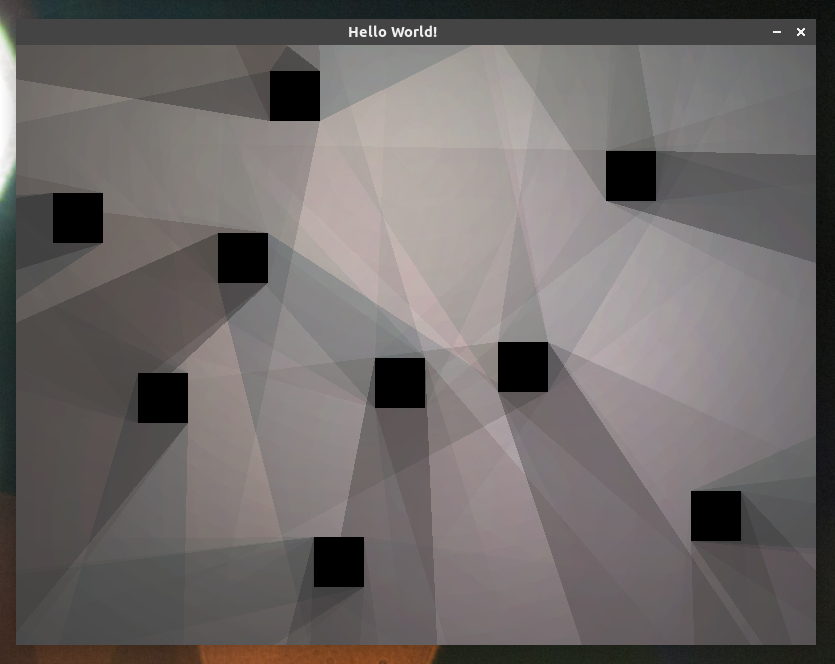

Shadow example
==============
Simple demo with 2D shadows written in Java with LWJGL library. [Click here to see it on Youtube.](https://www.youtube.com/watch?v=m8qbrWXskus)



### How to run?
```
$ ./gradlew run
```

### How to make a .jar file?
```
$ ./gradlew shadowJar
```
Then it should be in `./build/libs/shadow-example-0.1-all.jar`
